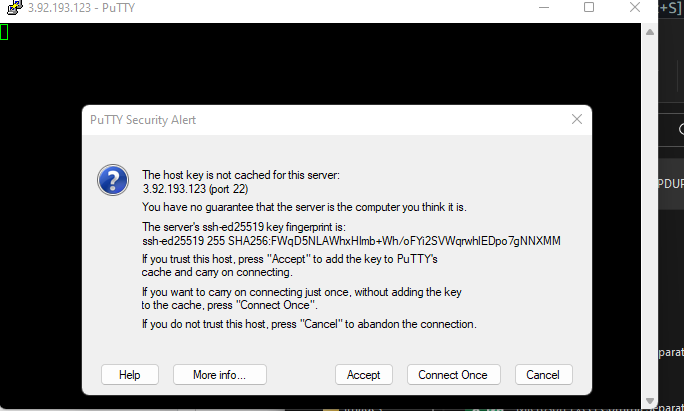

# PUTTY
Connect to AWS ec2 instance using Putty

- Select region (launch a new EC2 instance of t2.micro family with Ubuntu Server 20.04 LTS (HVM)

- Create a key pair while creating your Ec2 instance. Create a key pair and choose download  .ppk as private key format.

-Network settings allow  

- HTTP
   &
- HTTPS

- Leave everyother configuration as default and Launch instance.

[Download putty here](https://www.chiark.greenend.org.uk/~sgtatham/putty/latest.html) Putty.exe

After download Run Putty, copy your public ipv4 address and paste

 as seen in the image

Click on connection, input 30

Expand SSH, click on AUTH and browse for your key.

Click on Accept

Login as Ubuntu

