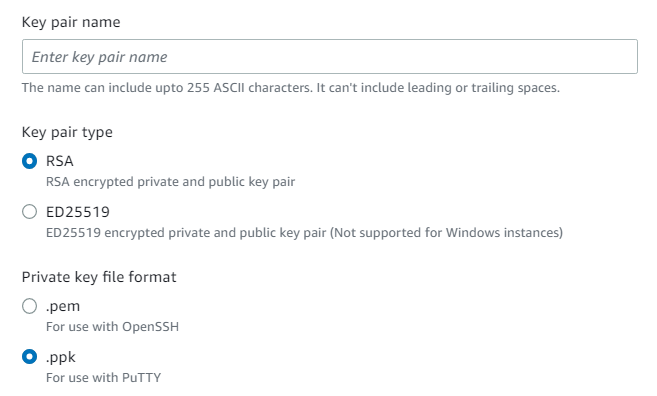
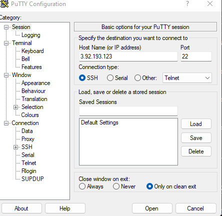
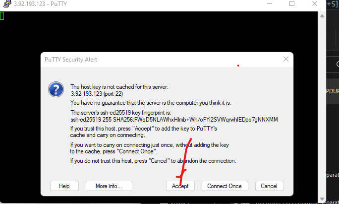
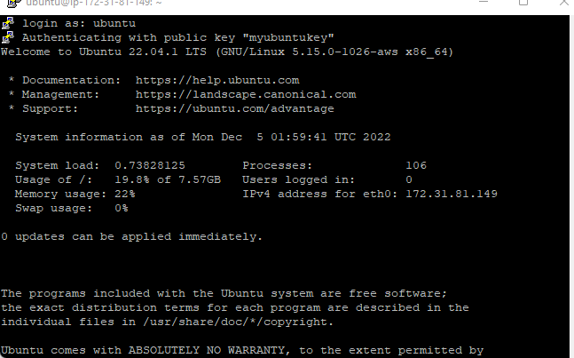

# PUTTY
Connect to AWS ec2 instance using Putty

- Select region (launch a new EC2 instance of t2.micro family with Ubuntu Server 20.04 LTS (HVM)

- Create a key pair while creating your Ec2 instance. Click on `.ppk` to download a .ppk key as private key format.

-Network settings allow  

- HTTP
   &
- HTTPS

- Leave every other configuration as default and Launch instance.

[Download putty here](https://www.chiark.greenend.org.uk/~sgtatham/putty/latest.html) Putty.exe

After download Run Putty, copy your public ipv4 address and paste

 as seen in the image

Click on `connection`: Input 30

Expand `SSH`, click on `AUTH` and browse for your ***.ppk***  private key.

Click on Accept

Login as Ubuntu

